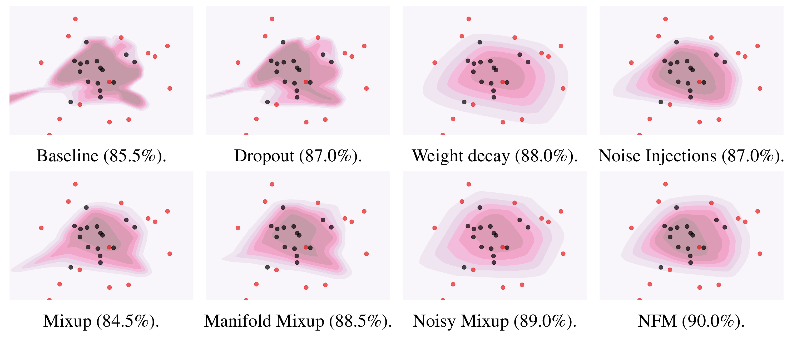
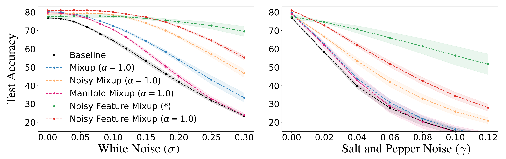

# Noisy Feature Mixup (NFM)

NFM is a simple, inexpensive yet effective data augmentation method that can help improve the predictive accuracy and robustness of vision models. NFM combines ideas of [input mixup](https://arxiv.org/abs/1710.09412), [manifold mixup](https://arxiv.org/abs/1806.05236) and noise injections, and include them as special cases. Rather than training with convex combinations of pairs of examples and their labels, NFM use noise-perturbed convex combinations of pairs of  data points in both input and feature space. NFM can be implemented on top of manifold mixup, introducing minimal computation overhead.

The advantage of NFM compared to other schemes is illustrated on the following binary classification task on a noisy toy dataset, where it can be seen that NFM smoothes the decision boundary.

<p align="center">
    
</p>

The advantage for training Wide-ResNets on CIFAR-100 is illustrated by the figure below. The model trained with NFM has the best predictive accuracy on clean data, while also being more robust with respect to data pertubations as compared to the baseline model and other data augmention schemes. 

<p align="center">
    
</p>

To use NFM, we need a code block that perturbs a minibatch with white noise and multiplicative noise.

```
def _noise(x, add_noise_level=0.0, mult_noise_level=0.0, sparsity_level=0.0):
    add_noise = 0.0
    mult_noise = 1.0
    with torch.cuda.device(0):
        if add_noise_level > 0.0:
            add_noise = add_noise_level * np.random.beta(2, 5) * torch.cuda.FloatTensor(x.shape).normal_()
        if mult_noise_level > 0.0:
            mult_noise = mult_noise_level * np.random.beta(2, 5) * (2*torch.cuda.FloatTensor(x.shape).uniform_()-1) + 1 
    return mult_noise * x + add_noise
```

Then, the following block can be used as a drop-in replacement for the widely used mixup function. If the noise levels are set to 0, then we yield the classic mixup scheme, otherwise we yield a form of noisy mixup.

```
def nfm(x, y, alpha=0.0, add_noise_level=0.0, mult_noise_level=0.0):
    lam = np.random.beta(alpha, alpha) if alpha > 0.0 else 1.0
    index = torch.randperm(x.size()[0]).cuda()
    mixed_x = lam * x + (1 - lam) * x[index]
    y_a, y_b = y, y[index]
    return _noise(mixed_x, add_noise_level=add_noise_level, mult_noise_level=mult_noise_level), y_a, y_b, lam
```

The criterion that we use for training the model is similar to the original mixup criterion.

```
def mixup_criterion(criterion, pred, y_a, y_b, lam):
    return lam * criterion(pred, y_a) + (1 - lam) * criterion(pred, y_b)
```

To take the full advantage of NFM, one needs also to modify the forward pass of the network. Here is an example for ResNets.

``` 
def forward(self, x, targets=None, mixup_alpha=0.0, manifold_mixup=0, 
                add_noise_level=0.0, mult_noise_level=0.0):
           
        k = 0 if mixup_alpha > 0.0 else -1
        if mixup_alpha > 0.0 and manifold_mixup == True: k = np.random.choice(range(4), 1)[0]
        
        if k == 0: # Do input mixup if k is 0 
          x, targets_a, targets_b, lam = nfm(x, targets, alpha=mixup_alpha, 
                                              add_noise_level=add_noise_level, 
                                              mult_noise_level=mult_noise_level)

        out = self.conv1(x)
        
        for i, ResidualBlock in enumerate(self.blocks):
            out = ResidualBlock(out)
            if k == (i+1): # Do manifold mixup if k is greater 0
                out, targets_a, targets_b, lam = nfm(out, targets, alpha=mixup_alpha, 
                                           add_noise_level=add_noise_level, 
                                           mult_noise_level=mult_noise_level)

        out = F.avg_pool2d(out, 4)
        out = out.view(out.size(0), -1)
        out = self.linear(out)
        
        if mixup_alpha > 0.0:
            return out, targets_a, targets_b, lam
        else:
            return out
```

If you would like to use our code, you can simply train a ResNet-18 with NFM on CIFAR-10 as follows.


```
python train_cifar.py --arch preactresnet18 --alpha 1.0 --add_noise_level 0.4 --mult_noise_level 0.2 --manifold_mixup 1 --seed 1
```

You can also simply train a Wide-ResNet-18 with NFM on CIFAR-100 as follows.

```
python train_cifar.py --name cifar100 --arch preactwideresnet18 --alpha 1.0 --add_noise_level 0.4 --mult_noise_level 0.2 --manifold_mixup 1 --seed 1
```


For more details, please refer to the [paper](https://arxiv.org/abs/2110.02180). If you find this work useful and use it on your own research, please concider citing our paper.


